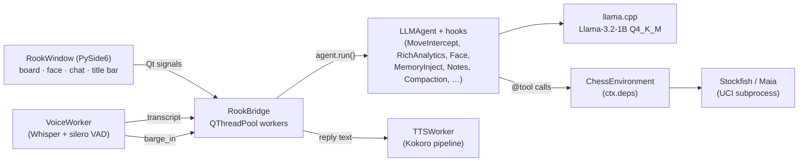

# RookApp — Desktop Chess Robot

Voice-controlled offline chess partner. Pure PySide6 app — no browser,
no web server, no Node toolchain, no Tauri. One Python process hosts
the Qt UI, the `LLMAgent`, llama-cpp, and the Stockfish subprocess.


## Install

```bash
# 1. Install the desktop extra.
uv pip install -e '.[desktop]'

# 2. Stockfish must be on $PATH at runtime (GPL — we only speak UCI
#    over a pipe, so the app stays MIT).
sudo apt-get install -y stockfish      # Linux
brew install stockfish                 # macOS
#    Windows: https://stockfishchess.org/download/ — drop on PATH.

# 3. Download EdgeVox STT + LLM + TTS weights (~3 GB, one time).
edgevox-setup
```

The `desktop` extra pulls in (licence in brackets):

| Package | Purpose |
|---|---|
| `PySide6>=6.6` [LGPL-3, dynamic] | UI toolkit |
| `qtawesome>=1.4` [MIT] | Font Awesome + Phosphor icon glyphs |
| `rlottie-python>=1.3` [LGPL-2.1, dynamic] | Optional — Lottie-backed robot face |
| `pillow>=10` [MIT/HPND] | Frame rendering for rlottie |

`rlottie-python` is optional. When it's missing or the asset bundle isn't
available, the face widget falls back to a pure-Qt `RobotFaceWidget`
(checked at runtime via `lottie_face.is_available()`).

## Launch

```bash
edgevox-chess-robot
```

The window paints immediately and the status pill cycles from
**loading…** through step labels (`"downloading …"`, etc.) to **online**
once llama-cpp + Stockfish are up. Model load is handled by a
`QThreadPool` worker so the event loop never stalls.

### CLI flags

All flags are optional — every knob also has an env var and a persisted
setting, in that priority order (CLI > env > QSettings > default).

```bash
edgevox-chess-robot \
    --persona trash_talker \          # grandmaster | casual | trash_talker
    --user-plays black \              # white (default) | black
    --engine stockfish \              # stockfish | maia
    --stockfish-skill 12 \            # 0–20
    --maia-weights ~/maia-1500.pb.gz  # required with --engine maia
    -v                                # or --verbose, debug logging
```

### Env vars

Same surface as `RookConfig.from_env`, so migrating from the old
chess_robot server flow doesn't require renaming anything:

| Env var | Maps to |
|---|---|
| `EDGEVOX_CHESS_PERSONA` | `--persona` |
| `EDGEVOX_CHESS_USER_PLAYS` | `--user-plays` |
| `EDGEVOX_CHESS_ENGINE` | `--engine` |
| `EDGEVOX_CHESS_STOCKFISH_SKILL` | `--stockfish-skill` |
| `EDGEVOX_CHESS_MAIA_WEIGHTS` | `--maia-weights` |

### Models

| Role | Default | Notes |
|---|---|---|
| LLM | `qwen3-1.7b` (preset slug) | `MoveInterceptHook` handles chess tools deterministically, so the LLM only has to talk naturally. Qwen3 1.7B is the default (Apache-2.0, ~1.1 GB). Users can switch to `llama-3.2-1b` (~0.8 GB, casual voice) or `gemma-4-e2b` (~1.8 GB, strongest at structured briefings) from the **Chat model** row in the Settings dialog. |
| STT | Whisper (lazy) | Loaded on first mic click — text-only users never pay the cost. |
| TTS | Kokoro (lazy) | Loaded on first reply; muted → not loaded at all. |

## In-app controls

The title bar exposes four icon buttons: **🎤 mic**, **↻ new game**,
**☰ menu**, and the window controls.

The **☰** button opens a dropdown:

- **New game** — wipes memory + notes + chat history + persisted session, then prompts Rook to announce the new match
- **Settings…** — preferences dialog
- **About RookApp** — brief status line in the title bar

Keyboard shortcut: **Ctrl+N** / **Cmd+N** for new game.

### Settings dialog

| Field | Options | Applies |
|---|---|---|
| Persona | `casual`, `grandmaster`, `trash_talker` | **live** — swaps agent instructions, face hook, accent colour. Engine strength waits for next *new game* so the in-progress board isn't clobbered. |
| Chat model | `qwen3-1.7b` (default) · `llama-3.2-1b` · `gemma-4-e2b` | next launch — swapping the GGUF requires a fresh llama-cpp load. |
| Piece set | Fantasy (default) · Celtic · Spatial | live |
| Board theme | Wood · Green · Blue · Gray · Dark wood · Night | live |
| Enable voice input | on / off | next launch |
| Mute sound effects | on / off | live (controls whether Kokoro loads at all) |
| Debug mode | on / off | live — two surfaces: (1) taps `before_llm` / `after_llm` / `on_run_end` and dumps the messages array + raw reply + final reply into the chat as monospace bubbles; (2) renders the per-turn analytics breakdown (YOU / ROOK / engine eval) as system-info bubbles. Off by default — the regular chat stays clean. |
| Microphone | PortAudio input devices | next launch |
| Speaker | PortAudio output devices | next launch |

Preferences persist via `QSettings("EdgeVox", "RookApp")`. A live preview
strip in the dialog shows the selected theme + piece set together before
you hit **OK**.

## Persona accents

Each persona carries a colour that threads through the title bar, chat
chips, persona label, and face highlight:

| Persona | Accent |
|---|---|
| `grandmaster` | `#7aa8ff` (blue) |
| `casual` | `#ffb066` (orange) |
| `trash_talker` | `#ff5ad1` (magenta) |

## On-disk state

Everything is stored under Qt's per-user `AppDataLocation` (falls back to
`~/.rookapp` on bare headless CI):

- `memory.db` — `SQLiteMemoryStore` in WAL mode for long-term facts, crash-safe atomic writes. Older installs that wrote `memory.json` are migrated transparently on first launch; the legacy file is renamed to `memory.json.migrated` and left in place as a backup.
- `notes.md` — `NotesFile` scratchpad the `NotesInjectorHook` reads
- `sessions.json` — `JSONSessionStore` chat history, restored on next launch
- `game.json` — board + move history (FEN + SAN), so a crashed match resumes exactly where it was
- `QSettings` — platform-native registry/plist/INI for UI preferences (piece set, board theme, audio devices)

**New game** wipes all four so commentary from a previous game can't leak
into a fresh board.

## Architecture



Blocking agent turns run on a `QThreadPool` worker; agent events become
Qt signals via the bridge's `_Signals` bus (`state_changed`,
`chess_state_changed`, `face_changed`, `reply_finalised`, `user_echo`,
`error`, `ready`, `load_progress`, `debug_event`).

### Barge-in

Voice interrupt runs through the same `InterruptController` the rest of
EdgeVox uses:

1. `AudioRecorder` energy-ratio gate detects the user speaking over TTS.
2. `VoiceWorker.barge_in` signal reaches `RookWindow._on_barge_in`.
3. `TTSWorker.interrupt()` cuts playback; `Bridge.cancel_turn()` trips
   the controller which plumbs `cancel_token` into
   `LLM.complete(stop_event=…)` — llama-cpp halts within one decode step
  .
4. `ctx.stop` flips so the agent loop exits between hops.

The recorder is linked to the global `InterruptiblePlayer`, so TTS
playback already pauses the mic queue at the source — no double-gating.

### Hooks installed on the agent

- `MoveInterceptHook` — deterministic move application so a missed tool
  call can't freeze the board
- `CommentaryGateHook` — the brains of Rook's commentary. Reads the
  post-move snapshot, decides whether to speak, and stashes a
  grounded `commentary_directive` for the briefing when it does. See
  [Commentary quality](#commentary-quality--evaluation) below.
- `RichChessAnalyticsHook` — hidden system-role briefing. Renders
  either the focused `YOUR ROLE + GROUND TRUTH + MOOD CUE` shape
  (when the gate set a directive) or the legacy rich card (fallback).
- `RobotFaceHook` — emits `robot_face` events → translated to the
  `face_changed` Qt signal
- `MoveCommentaryHook` — captures the latest move outcome
- `SilenceSentinelHook`, `ThinkTagStripHook`, `VoiceCleanupHook`,
  `SentenceClipHook`, `BriefingLeakGuard` — `AFTER_LLM` sanitation
  stack before reply reaches the chat bubble
- `MemoryInjectionHook`, `NotesInjectorHook`, `ContextCompactionHook`,
  `TokenBudgetHook`, `PersistSessionHook` — standard memory plumbing
- `default_slm_hooks()` — the SLM hardening stack for 1B-class models
- `DebugTapHook` — always installed; emits only when **Debug mode**
  is on (zero-cost path otherwise). Pulled out of the RookApp bridge
  into `edgevox.agents.hooks_builtin` so TUI / server / CLI can
  reuse the same tap via `enabled=<callable>` predicate.

## Commentary quality & evaluation

Small LLMs (1-2 B params) are unreliable at two things the naive prompt
asks of them:

1. **Staying silent on routine moves.** They emit filler every turn,
   no matter how many times the prompt says "you don't have to speak".
2. **Not inventing tactical claims.** Given a FEN + eval briefing
   they'll cheerfully claim pins, forks, attacks-on-squares that
   don't exist. Real bug we hit: 1B model said *"your knight is
   pinning my queen"* when the user had played a bishop and no pin
   existed.

RookApp solves both deterministically rather than trusting the model.
`CommentaryGateHook` does three things every turn:

### 1. Decide whether Rook should speak

Gate fires at `ON_RUN_START`, priority 85 (after `MoveInterceptHook`
at 90 applies the user's move + engine reply). It inspects:

| Signal | Triggers speech |
|---|---|
| Game over / checkmate / stalemate | Always |
| Check given or received (SAN `+` / `#`) | Always |
| Any capture (SAN contains `x`) | Always |
| Classification: inaccuracy / mistake / blunder | Always |
| Promotion (SAN contains `=`) | Always |
| Quiet move (classification best/good, no capture/check) | Silent — increment `quiet_streak` |
| `quiet_streak` reaches 3 | Force a low-intensity keepalive remark |
| First turn of the game (`greeted` flag unset) | Always — persona greeting |

Silent turns `HookResult.end("")` the run *before the LLM even loads a
message* — zero inference cost, zero fabrication risk.

### 2. Build a GROUND TRUTH block

When Rook speaks, the gate assembles a focused directive instead of
letting the model read the FEN-heavy legacy briefing. Structure:

```text
[CHESS BRIEFING — internal context, do not read aloud verbatim]
YOUR ROLE: You are Rook, playing the BLACK pieces. The human opponent
plays WHITE. When the directive says "you"/"your" it means YOU (Rook,
black); "the user" means the human (white). Never confuse the two.

GROUND TRUTH — this is the moment you're reacting to. Use it as your
launchpad, then react in character with attitude that matches the
situation: confident if the score says you're winning, rattled if
it says the user is winning, curious when things get sharp.
- The user played: bishop from f1 to a6 (Ba6)
- You (Rook) played: knight from b8 to a6, capturing a bishop (Nxa6)
- Material change this turn: YOU gained 3 points of material (the
  user came out worse). React accordingly — this is a good turn.
- Engine evaluation (from your side): +3.50 pawns — you have a clear
  advantage

MOOD CUE: you have a clear edge — sound pleased with your position.

MOVE HISTORY (last turns, eval from your side in pawns — negative
means the user is ahead):
- turn 1: user pawn e2→e4, you pawn e7→e5 · eval +0.00
- turn 2: user bishop f1→a6, you knight b8→a6 capturing bishop ·
  eval +3.50 · swung +3.50 · last move: best

Stay grounded: only claim tactics listed above, never invent pins /
forks / attacks on pieces you can't see. If nothing specific comes
to mind in persona, reply exactly `<silent>`.
[END BRIEFING]
```

Every claim is derived from verified env state. The model can only
*narrate* facts that are already in the block; it can't invent a
pin because there's no pin line to invent from.

### 3. Emit a chat-visible analytics bubble

The gate emits a `move_analytics` event every turn, whether Rook
speaks or not. The bridge translates it into a subdued system-info
bubble in the chat — structured per-turn breakdown (piece names,
squares, captures, classification, eval from *the user's* POV) so
the user can always see what's happening even during silent phases.

### Sign-flip safety

The LLM directive uses Rook's pronouns (`you` = Rook). The chat
bubble uses the user's pronouns (`you` = user). These are generated
from the same eval but with flipped sign and inverted "who is winning"
text — `_score_line` vs `_score_line_user_facing` in
`commentary_gate.py`. A pair of regression tests
(`TestScenarioSignFlipUserWhite` / `TestScenarioSignFlipUserBlack`)
locks both forms in place so a future edit can't silently send Rook's
"you are winning" text to a losing user.

### Scripted scenario test harness

`tests/chess_robot/test_scripted_scenarios.py` drives the gate
through full games turn-by-turn against a fake environment. Each
scenario is a **specific failure-mode probe**, not a happy-path
check — modelled after actual bugs we've hit or ones that are
plausible given the code shape:

| Scenario | What it guards |
|---|---|
| `TestScenarioSignFlipUserWhite` / `…Black` | Chat bubble must address the user, not the LLM (regression for the 2026-04-19 eval-sign bug). |
| `TestScenarioGreetingExactlyOnce` | Greeting fires on move 1 and never re-fires in the same game. |
| `TestScenarioQuietStreakKeepalive` | After three silent turns the gate forces a keepalive remark, then resets. |
| `TestScenarioCheckmate` | Game-over branch owns terminal turns. |
| `TestScenarioCaptureDescriptions` | Directive names real moving + captured pieces via pre-move board replay. |
| `TestScenarioClassificationAttribution` | `"that last move by you"` vs `"by the user"` matches actual parity. |
| `TestScenarioBlunderHungBishop` | Material-change line + mood cue present (regression for "bold move, you're gaining the initiative" on a losing position). |
| `TestScenarioRoleHeader` | Every mid-game directive leads with the explicit side / role header. |
| `TestScenarioIdempotentOnRepeatState` | Non-move user input (e.g. "what's the score?") doesn't re-emit analytics or re-inject stale directives. |

### Improvement log

Historical fixes the harness now guards against:

- **Briefing leak** — 1B model parroted the `[CHESS BRIEFING]` block
  back as its reply. Added `BriefingLeakGuard` at priority 68
  (between `ThinkTagStripHook` and `VoiceCleanupHook`) to strip the
  block plus header-less leaks where the model dropped the opening
  marker but kept the closing one.
- **Comment every move** — dialled back by adding
  `CommentaryGateHook`'s noteworthy-signal filter.
- **Hallucinated tactics** — replaced FEN/PV-heavy briefing with the
  focused `YOUR ROLE + GROUND TRUTH + MOOD CUE` shape.
- **Eval sign flip in chat bubble** — split `_score_line` into two
  perspective-aware variants.
- **Loading panel never hides** — migrated the board-area stack from
  `QStackedLayout` to `QStackedWidget` so the non-current widget is
  actually `hide()`'d.
- **Template leakage** — removed `"bold"`, `"ouch"`, `"nice one"` as
  literal examples in the directive; the model was copy-pasting
  them verbatim on losing positions (calling a user blunder a
  "bold move").
- **Non-move input duplicates** — gate tracks `last_gate_ply` in
  session state and short-circuits when the board hasn't advanced.
- **Game-over attribution inversions** — small LLMs frequently said
  "I'll keep playing" after being mated, or thanked the user for a
  blunder. Terminal turns (mate / stalemate / draw) now bypass the
  LLM entirely: `CommentaryGateHook._canned_game_end` picks a
  per-persona templated closer (*"Mate. Well played."*, *"You got
  me. This time."*, *"Stalemate — fair enough."*) and returns via
  `HookResult.end`. Zero latency, zero attribution risk.

### Chess commentary benchmark

The [chess commentary benchmark](/documentation/reports/chess-commentary-benchmark)
compares 25 LLMs across 36 scenarios (openings / midgame / endgame /
terminal / color flips) and informs the default model choice +
Settings picker ranking. Heuristic quality score alone is misleading —
several models score 99-100 on the grader but fail semantic audit
(echo SAN, invert mate attribution, recite the directive). The report
documents methodology, decision matrix, and reproduction.

Re-run after any gate or prompt change to catch regressions:

```bash
python scripts/bench_chess_commentary.py                 # full 25-model sweep
python scripts/eval_llm_commentary.py --model gemma-4-e2b  # iterate on one model
python scripts/analyze_bench_results.py                   # quality × speed Pareto
```

## Packaging an installer

Single-file binaries are produced by
`.github/workflows/rookapp-desktop.yml` for tags matching `rook-v*`
(macOS arm/intel, Windows, Linux AppImage). Locally:

```bash
uv pip install -e '.[desktop]' pyinstaller
cat > rookapp_entry.py <<'PY'
from edgevox.apps.chess_robot_qt.main import main
if __name__ == "__main__":
    main()
PY
pyinstaller \
    --name RookApp --onefile --windowed \
    --hidden-import edgevox.apps.chess_robot_qt \
    --collect-submodules edgevox \
    rookapp_entry.py
```

Output lands under `dist/`. The bundle ships code only; STT / LLM / TTS
weights download to the Hugging Face cache on first run. Stockfish must
still be present on `$PATH` at runtime.

## Licence notes

- PySide6 — LGPL-3, dynamic-linked (MIT-app compatible)
- qtawesome, pillow — MIT / HPND
- rlottie-python — LGPL-2.1 via ctypes (dynamic-linked)
- Maurizio Monge piece sets — MIT
- Kokoro TTS — MIT
- Stockfish — GPL, **out-of-process**: we talk UCI over a pipe, never
  link it, so the app stays MIT.
