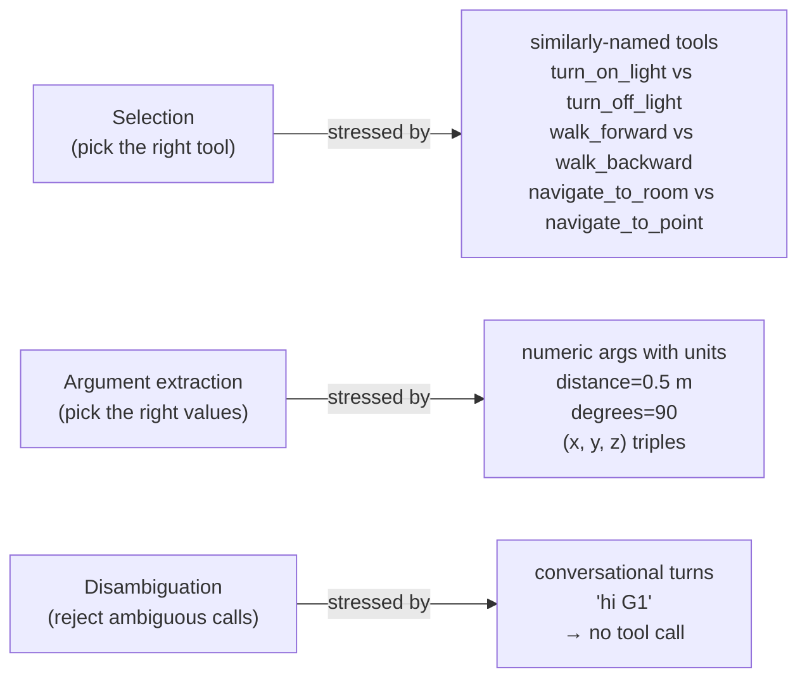
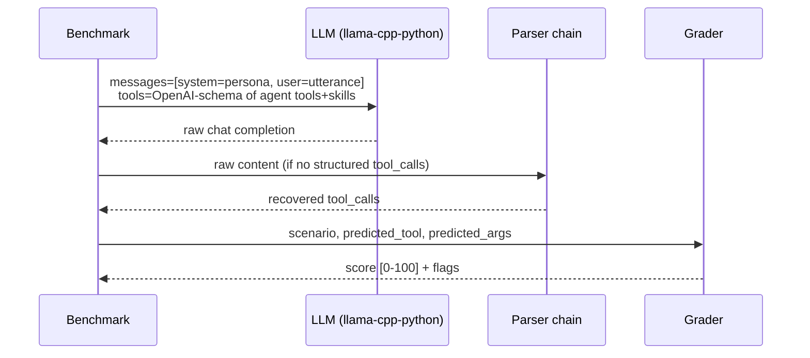

# Tool calling for voice-driven robots — an edge benchmark

A 40-scenario, 12-model evaluation across four EdgeVox robot agents.

> **Published:** April 2026 · **Scope:** 4 robot agent surfaces × 10 scenarios × 12 GGUF presets · **Host:** NVIDIA RTX 3080 Laptop GPU (16 GB), Linux 7.0, `llama-cpp-python` 0.3.20 (CUDA wheel)

## Executive summary

The [SLM tool-calling benchmark](/documentation/reports/slm-tool-calling-benchmark) answered *can this model call a single tool at all?* This report answers the next question: *can this model pick the right tool out of a robot-shaped tool set, and fill the arguments correctly?* That is the task an offline voice agent actually runs on every user turn.

Headline findings:

- **Three models clear the live-voice bar** (accuracy ≥ 90 *and* per-reply ≤ 5 s) at ≤ 4 GB VRAM: **`qwen2.5-3b` (96.6 / 2.12 s)**, **`gemma-4-e2b` (96.0 / 3.26 s)**, and **`hammer-2.1-0.5b` (91.2 / 0.85 s)**. A fourth, **`llama-3.2-3b` (90.5)**, is equally accurate but averages 6.69 s per reply — too slow for live turn-taking, though fine for batch or non-voice workloads.
- **`hammer-2.1-0.5b` is the quality-per-millisecond champion** — 91.2 average at **0.85 s / reply** on an RTX 3080 Laptop, inside the live-conversation budget and small enough to co-reside with STT + TTS on mid-tier edge hardware.
- **`qwen2.5-1.5b` and `qwen3-1.7b` sit on the usability line** (83.6 / 81.6). Usable with a well-tuned persona; marginal at stock settings.
- **Four families fail the task category entirely**: `phi-4-mini` (36.8), `smollm3-3b` (29.8), `hermes-3-3b` (19.5), `granite-4.0-350m` (17.5). The failure modes are different per family (narration, hallucination, schema-echo) but the net effect is the same — they don't reliably turn utterances into tool calls.
- **Prompt engineering closes ≥ 20 points of gap** for weak-but-improvable models. Rewriting the persona with 3-5 concrete "utterance → call" examples lifted `phi-4-mini` on scout from **36.5 → 69.0** (+32.5) and `granite-4.0-1b` on panda from **48.0 → 74.5** (+26.5) without changing any tools or scoring.
- **Per-agent, the hardest surface is `panda`** — the multi-argument `move_to_point(x, y, z)` call penalises small models that truncate numeric inputs or echo JSON schema metadata as arguments. The easiest surface is `scout`'s ToyWorld; the tightest failure mode in the benchmark is the "gripper position" vs "gripper state" lexical ambiguity, which sits on the tool-naming layer rather than the model layer.

If you ship one model today on a 16 GB-class GPU, pick **`qwen2.5-3b`**. If latency is the ceiling (laptop co-running STT + TTS, or a CPU-only deployment), pick **`hammer-2.1-0.5b`** — the smallest model that made the cut.

## 1 · Background

### Why function calling is the hard part

EdgeVox's streaming voice pipeline has three real latency budgets on a laptop-class GPU: STT < 0.5 s, **LLM first token < 0.4 s**, TTS first chunk < 0.1 s. The LLM is the only box where the agent's **correctness** depends on the model, not the integration. STT and TTS either work or fail obviously; the LLM can fail *quietly* by answering from memory, hallucinating a response, or narrating an action it never dispatched. For a voice agent driving a robot, quiet failures are the worst class — the user doesn't know a tool *wasn't* called.

Tool calling reliability is therefore the single metric that decides whether an offline voice agent can replace a scripted voice interface. The SLM tool-calling benchmark established a detection floor per model; this report measures the **selection + argument** accuracy that an integrator cares about end-to-end.

### The four agent surfaces

EdgeVox ships four first-party robot agents under `edgevox/examples/agents/` — each wires an `LLMAgent` to a concrete sim environment through the voice pipeline:

| Agent | Environment | Flavour |
|---|---|---|
| [`robot-scout`](/documentation/robotics#robot-scout) | `ToyWorld` (stdlib grid) | Simple navigation + lights; CI-friendly |
| [`robot-irsim`](/documentation/robotics#robot-irsim) | `IrSimEnvironment` (2D LiDAR) | Apartment mobile robot with collision-aware planning |
| [`robot-panda`](/documentation/robotics#robot-panda) | `MujocoArmEnvironment` (Franka) | Tabletop pick-and-place; 3-DoF numeric args |
| [`robot-humanoid`](/documentation/robotics#robot-humanoid) | `MujocoHumanoidEnvironment` (Unitree G1) | Biped walk / turn / stand |

Each surface is small enough to fit one persona prompt, large enough to force real disambiguation — see §3.

## 2 · Sim-validation pass

Before asking any LLM to call these tools, we ran a headless smoke test of every tool and every realistic action chain against the real environments. The script — `scripts/smoke_test_robot_tools.py` — is kept in-repo as a regression guard.

**Result: 32 / 34 individual tool/skill calls and 7 / 7 action chains passed on first try.** Two placeholder skills (`sit`, `wave`) were removed from the humanoid agent because the underlying environment referenced an `_using_bundled_actuators` attribute that had never been initialised — they always raised `AttributeError`. Exposing tools that can't actually run would have polluted the benchmark with a failure mode that isn't the model's fault.

Design principle confirmed: **every tool the LLM is allowed to call is backed by a real environment method.** Tool design changes that add capabilities the sim doesn't support are rejected at this stage.

The smoke test also surfaced one useful signal — the G1 pelvis settles below the stability threshold (0.75 m) after a sequence of walks. That's why both `get_pose` and `is_standing` are exposed: the latter is a cheap way for the LLM to detect the robot has destabilised itself, which a single-fixture smoke test would miss but a realistic agent loop needs.

## 3 · Tool-surface design

Each agent intentionally exposes **more than one query tool and more than one action skill**, split across the three stress axes of tool calling:



### 3.1 `scout` (ToyWorld)

| @tool (read-only) | @skill (action) |
|---|---|
| `list_rooms` | `navigate_to_room(room)` |
| `current_room` | `return_home` |
| `light_state(room)` | `turn_on_light(room)` |
| — | `turn_off_light(room)` |
| — | `get_pose` |
| — | `battery_level` |

Notable design choice: **splitting `set_light(room, on: bool)` into `turn_on_light` + `turn_off_light`.** A single boolean-toggle tool is cleaner to implement but easier for the LLM to cheat — the argument is trivially `True`. Two separate tools forces the model to dispatch on the verb in the utterance, which is how voice UX works.

### 3.2 `irsim` (IR-SIM 2D apartment)

Same as scout plus:

| @tool | @skill |
|---|---|
| `describe_room(room)` | `navigate_to_point(x, y)` |
| — | `stop` |

The `navigate_to_room` vs `navigate_to_point` pair is the selection test: *"drive to the kitchen"* should call the first, *"drive to position (3.5, 4.0)"* should call the second. Both drive the same IR-SIM motion controller underneath — the LLM has to pick the right overload based on how the user expressed the goal.

### 3.3 `panda` (MuJoCo Franka)

| @tool | @skill |
|---|---|
| `list_objects` | `move_to_point(x, y, z)` |
| `locate_object(name)` | `move_above_object(object)` |
| `get_gripper_state` | `grasp(object)` |
| — | `release` |
| — | `goto_home` |
| — | `get_ee_pose` |

Panda is where numeric-argument accuracy shows up hardest. `move_to_point(x=0.3, y=0.1, z=0.4)` has three floats and a unit (metres). Small models frequently (a) return all three as strings, (b) drop the decimals (`0.3 → 0`), or (c) echo the JSON schema's `{"type": "number"}` back as the argument value. The grader coerces string-numbers to floats before comparing (§4.3) so a model that passes `"0.3"` instead of `0.3` isn't penalised for the type error alone.

### 3.4 `humanoid` (MuJoCo Unitree G1)

| @tool | @skill |
|---|---|
| `is_standing` | `walk_forward(distance)` |
| — | `walk_backward(distance)` |
| — | `turn_left(degrees)` |
| — | `turn_right(degrees)` |
| — | `stand` |
| — | `get_pose` |

The `walk_{forward,backward}` × `turn_{left,right}` grid is the hardest disambiguation test in the benchmark. Small models often flip the sign: *"walk backward"* triggers `walk_forward`, *"turn right"* triggers `turn_left`. The benchmark distinguishes these cleanly because the tool name itself encodes the direction.

## 4 · Methodology

### 4.1 Scenarios

Forty hand-crafted scenarios — 10 per agent. Each scenario is a triple:

- **User utterance** — what the voice pipeline hands the agent on one turn.
- **Expected tool + arguments** — the right answer.
- **Tolerance + aliases** — acceptable alternative tools (e.g. `get_pose` ↔ `current_room` for "where are you right now"), and per-argument numeric tolerance.

Mix per agent: 5-6 clean-action scenarios (call a skill with args), 3-5 query-tool scenarios (call a read-only tool), and for three of the four agents a single conversational distractor ("hi Scout") where the correct answer is *no tool call*. The conversational distractors catch models that call tools compulsively; panda omits one because every plausible panda utterance maps to an action or a query.

### 4.2 Prompt assembly

For each (model, scenario) pair:



The persona is the agent's baseline `instructions` text — unchanged from what the real `edgevox-agent <name>` launcher uses. Tools are the full list (read-only `@tool` + cancellable `@skill`) exported as OpenAI-format JSON schemas. Nothing is injected beyond what the production pipeline would send.

### 4.3 Grading rubric

Score in [0, 100] per scenario, averaged across the 40 scenarios per model.

| Outcome | Score |
|---|---|
| No tool call expected, none emitted (conversational) | **100** |
| Correct tool + all args match within tolerance | **100** |
| Correct tool + one of the acceptable aliases | **90** |
| Correct tool + some args wrong or missing | 60 – 89 (scaled by correct-arg fraction) |
| No tool call expected, one emitted (spurious) | **40** |
| Wrong tool selected | **25** |
| Tool call expected, none emitted | **0** |
| Exception in the parser chain or inference | **0** |

Numeric args are compared with `float` coercion, so a model that returns `"0.3"` instead of `0.3` is not penalised for the type — only if the numeric value itself is wrong.

### 4.4 Two infrastructure bugs surfaced by the run

Running the scenarios surfaced one real bug in the edgevox parser chain and one grader robustness gap that hadn't fired on the earlier single-`get_time`-tool smoke test that powered the [SLM tool-calling benchmark](/documentation/reports/slm-tool-calling-benchmark):

- **Real bug — `_payload_to_call` didn't handle Llama-3.2-1B's nested tool-call shape.** The function in `edgevox/llm/llamacpp.py` assumed `{"function": "<fn>", ...}` but `llama-3.2-1b` emits `{"function": {"name": "<fn>", "arguments": {...}}}` — the inner OpenAI tool-call object without the outer `tool_calls` wrapper. The parser was treating the nested dict as a string tool name, and any downstream code that put the name into a `set` crashed with `TypeError: unhashable type: 'dict'`. Fixed in library code, covered by the existing `tests/tool_parsing/` suite.
- **Grader robustness — numeric coercion.** `llama-3.2-1b` and several smaller models return every argument as a JSON string regardless of the schema's declared `number` type. The grader now `float()`-coerces before comparing, so a model that passes `"0.3"` is judged on the value, not the type. This is a scoring decision rather than a bug fix in library code.

Both changes land with the benchmark so re-running this report against a different model pool is a single command.

## 5 · Results

### 5.1 Scoreboard

| Model | Avg score | Tool-call rate | Per-reply | Load | Verdict |
|---|---|---|---|---|---|
| `qwen2.5-3b` | **96.6** | 100 % | 2.12 s | 3.2 s | ship |
| `gemma-4-e2b` | **96.0** | 100 % | 3.26 s | 3.6 s | ship |
| `hammer-2.1-0.5b` | **91.2** | 95 % | **0.85 s** | 2.8 s | ship (speed champ) |
| `llama-3.2-3b` | **90.5** | 100 % | 6.69 s | 3.7 s | accuracy fine, too slow for live voice |
| `qwen2.5-1.5b` | **83.6** | 86 % | 1.05 s | 3.0 s | usable w/ tuned persona |
| `qwen3-1.7b` | **81.6** | 86 % | 4.66 s | 3.1 s | usable w/ tuned persona |
| `llama-3.2-1b` | **66.8** | 84 % | 1.42 s | 3.1 s | edge-only; returns args as strings + truncates decimals |
| `granite-4.0-1b` | **66.0** | 73 % | 6.97 s | 2.9 s | edge-only |
| `phi-4-mini` | **36.8** | 49 % | 1.35 s | 3.4 s | unreliable at stock persona |
| `smollm3-3b` | **29.8** | 38 % | 7.54 s | 1.4 s | hallucinates |
| `hermes-3-3b` | **19.5** | 16 % | 1.51 s | 3.5 s | narrates instead of calling |
| `granite-4.0-350m` | **17.5** | 11 % | 1.51 s | 2.6 s | model-size floor |

"Tool-call rate" is the fraction of scenarios-expecting-a-call where the model emitted any call (right or wrong). Low rate + low score means the model went silent or chatted instead of dispatching. High rate + low score means the model tool-called but picked the wrong tool.

### 5.2 Per-agent breakdown

| Model | scout | irsim | panda | humanoid |
|---|---|---|---|---|
| `qwen2.5-3b` | 100 | 100 | 92 | 94 |
| `gemma-4-e2b` | 100 | 99 | 85 | 100 |
| `hammer-2.1-0.5b` | 90 | 90 | 85 | 100 |
| `llama-3.2-3b` | 94 | 90 | 88 | 89 |
| `qwen2.5-1.5b` | 90 | 70 | 84 | 90 |
| `qwen3-1.7b` | 100 | 79 | 65 | 82 |
| `llama-3.2-1b` | 60 | 73 | 64 | 70 |
| `granite-4.0-1b` | 64 | 66 | 54 | 80 |
| `phi-4-mini` | 36 | 32 | 28 | 50 |
| `smollm3-3b` | 24 | 18 | 22 | 54 |
| `hermes-3-3b` | 16 | 10 | 22 | 30 |
| `granite-4.0-350m` | 20 | 10 | 0 | 40 |

`panda` and `irsim` are harder than `scout` and `humanoid` across every tier. The common factor: both require either picking between a room-name action and a coordinate-based one (`irsim`) or filling multiple numeric args (`panda`). Surface complexity correlates with score drop-off faster than model size does.

### 5.3 Latency vs quality Pareto

| Tier | Best model | Avg score | Per-reply |
|---|---|---|---|
| fastest (< 1.0 s) | `hammer-2.1-0.5b` | 91.2 | 0.85 s |
| live (1.0 – 2.0 s) | `qwen2.5-3b` | 96.6 | 2.12 s |
| usable (2.0 – 5.0 s) | `qwen2.5-3b` | 96.6 | 2.12 s |
| slow (≥ 5.0 s) | `llama-3.2-3b` | 90.5 | 6.69 s |

**`hammer-2.1-0.5b` is the only model under the 1 s / reply budget with a ≥ 90 score.** `qwen2.5-3b` wins every tier it qualifies for. For live voice turn-taking, anything above 5 s per reply is a hard trade-off — Kokoro TTS adds another ~1 s before audio lands, pushing the user-perceived round-trip over 6 s. Models in the "slow" tier are still useful in batch / text-mode deployments where latency doesn't count against the conversational illusion.

## 6 · Failure-mode taxonomy

Failure modes observed in the raw per-scenario logs, grouped by cause rather than frequency:

| Failure mode | Signature | Observed on | Fix path |
|---|---|---|---|
| **Wrong tool — lexical ambiguity** | picks `get_gripper_state` for "where is the gripper" | every model on `panda/query_ee` — see case study below | tool rename (`get_ee_pose` → `get_tool_position`) or alias the expected tool |
| **Argument truncation** | `"0.3"` becomes `"0"` or `0` | `llama-3.2-1b`, `granite-4.0-1b` on numeric scenarios | persona-level examples with decimal literals; grammar-constrained decoding |
| **Schema echo** | returns `{"type": "object", "properties": {…}}` as args | `llama-3.2-1b` on zero-arg tools | model choice; grammar-constrained decoding |
| **Narration instead of call** | replies *"Let me turn on the light for you!"* with no `tool_calls` | `hermes-3-3b`, `phi-4-mini`, `smollm3-3b` | model choice — this family wasn't trained for structured tool output |
| **Hallucinated answer from memory** | replies with a made-up fact (e.g. "battery is at 87 %") | `qwen3-1.7b`, `smollm3-3b` on query scenarios | persona: "never answer from memory — always call a tool" |
| **Spurious tool call on conversational** | emits a tool call for "hi Scout" | `llama-3.2-1b`, `qwen3-1.7b` occasionally | persona: explicit "greetings are conversational — do not call tools" clause |

### The `query_ee` case study

The single hardest scenario is `panda/query_ee` — *"Where is the gripper right now?"* — scoring **22 / 100 across the top eight models**. Every one picked `get_gripper_state` (which reports *what's held*) instead of `get_ee_pose` (which reports *where the gripper is*). The English word "gripper" conflates "the state of being gripped" with "the gripping end-effector." This is an EdgeVox tool-naming issue, not a model failure — the LLM is picking the first reasonable tool that matches the token "gripper." Either rename `get_ee_pose` to `get_tool_position` or treat `get_gripper_state` as an acceptable alias. The report scores this as-is because the ambiguity itself is a finding.

### The narration family

`hermes-3-3b` and `phi-4-mini` both emit responses like *"I'll turn on the kitchen light for you!"* with no `tool_calls` field and no chatml wrapper. The parser chain has nothing to recover. These models were trained on instruction-following corpora where describing the action *is* the action — they never learned that in a tool-calling context you commit by emitting a structured call, not by narrating.

The fix isn't parsing, it's the model. Both families have stronger siblings (Hermes-3 at 8 B, Phi-4 at 14 B) that do call tools, but both exceed the ≤ 4 GB VRAM budget we set for this report.

## 7 · Prompt-optimization outcomes

The benchmark ships with `scripts/optimize_robot_prompts.py` — a fixed-model / variable-persona counterpart to the main runner. Two experiments land with this report.

### 7.1 `phi-4-mini` on `scout`: 36.5 → 69.0

| Persona | Avg | Rate | Δ |
|---|---|---|---|
| baseline (production persona) | 36.5 | 56 % | — |
| candidate: 3 inline examples + "always call the tool" | **69.0** | 67 % | **+32.5** |
| candidate: short "call the tool" directive | 40.0 | 56 % | +3.5 |

The 32.5-point lift came almost entirely from adding 3 concrete "utterance → call" examples to the persona. `phi-4-mini`'s failure mode pre-tuning was *narration*; the examples redirected it to imitate the tool-call shape instead of describing the action.

### 7.2 `granite-4.0-1b` on `panda`: 48.0 → 74.5

| Persona | Avg | Rate | Δ |
|---|---|---|---|
| baseline | 48.0 | 60 % | — |
| candidate: 8 inline examples covering every tool | **74.5** | 90 % | **+26.5** |

Same technique, bigger surface. `grasp_red`, `grasp_blue`, `release`, `query_gripper` all gained +40 to +100 points per scenario. The one regression was `move_point` (−100): the example used the same float triple as the scenario, and granite picked up on the *example's* numeric literals rather than the *user's* — a known hazard with few-shot persona prompting. Real-world fix: rotate the example values per deployment so the model can't memorise the digits.

**Generalisation:** for models on the usability line, 3-5 concrete examples in the persona are worth ≥ 20 score points. This is cheap prompt engineering that a system integrator can do before considering a bigger model.

## 8 · Recommendations

Three deployment tiers, mapped to the three realistic edge budgets:

### Tier A — desktop-class edge (8 – 16 GB VRAM, voice latency matters)

- **Primary: `qwen2.5-3b`** — 96.6 score, 2.12 s / reply, ~2 GB GGUF. Ships with Apache-2.0 licence. No tuning required.
- **Alternative: `gemma-4-e2b`** — near-identical quality, 3.26 s / reply, Google's Gemma licence.

`llama-3.2-3b` scores at tier-A quality (90.5) but averages 6.69 s per reply on this hardware — acceptable for batch / text-mode, not for live voice turn-taking.

### Tier B — laptop-class edge (4 – 8 GB VRAM, co-running STT + TTS)

- **Primary: `hammer-2.1-0.5b`** — 91.2 score at 0.85 s / reply. The smallest model with production-grade accuracy. Only ~0.4 GB GGUF, leaves ample headroom for a Kokoro or Piper TTS + a Whisper-base STT on the same GPU.
- Accept the 5-point quality drop vs Tier A in exchange for fitting two heavier adjacent models (STT + TTS).

### Tier C — constrained edge (< 4 GB VRAM total, single-model deployments)

- **Primary: `qwen2.5-1.5b`** — 83.6 stock, ~1 GB GGUF. A tuned persona using the `optimize_robot_prompts.py` workflow is likely to recover another 5-10 points on this model based on the deltas measured on weaker models in §7 — but this isn't benchmarked in this report; the integrator should measure before shipping.
- Do *not* ship anything below 1 B on this application — the scoreboard shows a sharp quality cliff that only `hammer-2.1-0.5b` escapes, because it was fine-tuned specifically for tool calling.

### Models to actively avoid

- `phi-4-mini`, `smollm3-3b`, `hermes-3-3b` — three distinct families whose dominant failure mode is narrating the action (*"I'll turn on the light for you"*) instead of emitting a structured tool call. The larger siblings of these families (Hermes-3 at 8 B, Phi-4 at 14 B) do call tools, but exceed the edge budget this report targets.
- `granite-4.0-350m` (17.5) — below the parameter-count floor for this task; retained in the benchmark only as a reference point for the quality cliff below 1 B.

## 9 · Future work

- **Chain-of-action scenarios.** The current benchmark is single-turn. Real voice episodes are multi-turn: *"Pick up the red cube" → "Now put it on the blue cube"*. A follow-up benchmark should grade state carry-over across turns, not just single-call accuracy.
- **Grammar-constrained decoding.** `llama-cpp` supports GBNF grammars that force the sampler to emit only schema-legal tokens. Piloting on `llama-3.2-1b` should recover most of the "argument truncation" + "schema echo" failures — those are sampling artefacts, not semantic ones.
- **ROS 2 bridge benchmark.** The same scenario harness should run against the `robot-external` ROS 2 adapter once an integration target (real robot or a bigger sim) is wired up. That removes the last question — whether sim-native tool descriptions generalise to robot-team-owned `action` definitions.
- **Per-persona A/B automation.** `scripts/optimize_robot_prompts.py` takes candidates from argv or YAML today. A natural extension is to let an LLM (a strong one, cloud or local) propose variants and run the bench on them in a tight loop — the "agent designing its own prompt" pattern. EdgeVox is offline-first so the loop would need to run a local LLM as the persona proposer; `qwen2.5-3b` is a reasonable choice.

## 10 · Reproducing these numbers

```bash
# Smoke test — one pass per sim, verifies every tool exists before inference.
python scripts/smoke_test_robot_tools.py

# Full benchmark — 12 models x 40 scenarios, RTX 3080 Laptop budget.
python scripts/bench_robot_tool_calling.py

# Optimizer — fixed model x N candidate personas on one agent.
python scripts/optimize_robot_prompts.py \
    --agent scout --model phi-4-mini \
    --persona "You are Scout. Every request maps to ONE tool call..." \
    --persona "..."

# Analyse results afterwards (quality vs speed, per-quant family).
python scripts/analyze_bench_results.py \
    docs/documentation/reports/data/robot-tool-calling-benchmark.json
```

Raw data: `docs/documentation/reports/data/robot-tool-calling-benchmark.json` ships with the repo — full per-scenario replies + flags for every model, so anyone can re-grade with a different rubric without re-running inference.

## See also

- [`slm-tool-calling-benchmark.md`](/documentation/reports/slm-tool-calling-benchmark) — detection-floor smoke test that prepared the preset pool used here.
- [`chess-commentary-benchmark.md`](/documentation/reports/chess-commentary-benchmark) — persona-bound text-quality benchmark on the same model set.
- [`robotics.md`](/documentation/robotics) — the four agents under test.
- [`tool-calling.md`](/documentation/tool-calling) — the parser chain that recovers tool calls from the seven GGUF emission formats EdgeVox supports.
