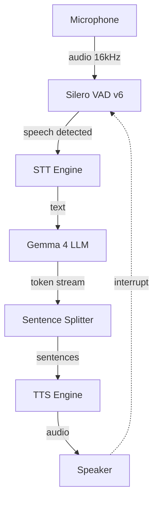
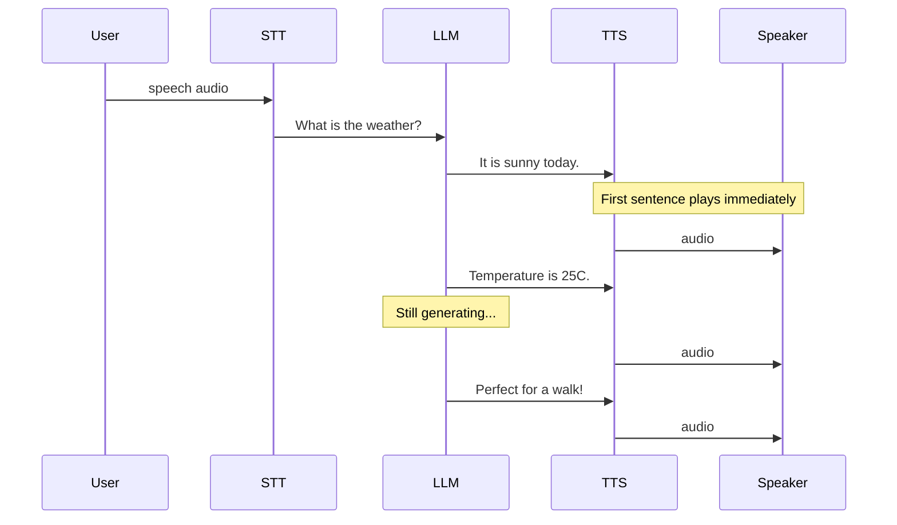
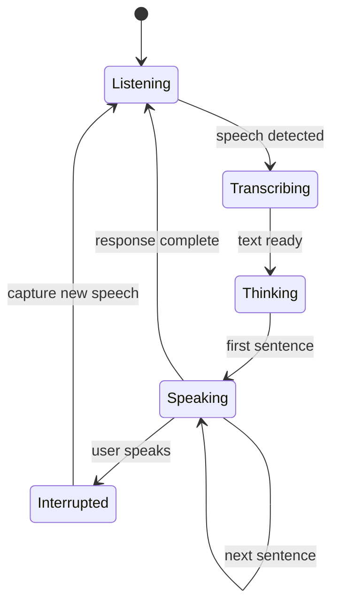
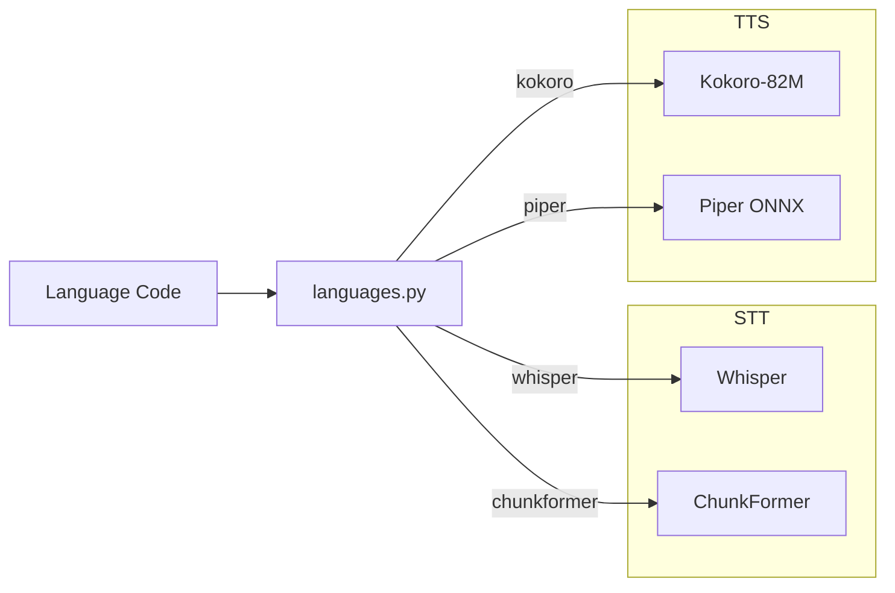
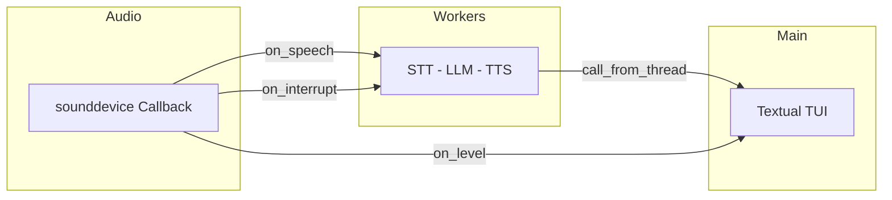

# Architecture

EdgeVox uses a streaming pipeline architecture optimized for minimum time-to-first-speech (TTFS).

## Pipeline Flow



## Streaming Strategy

The key to sub-second latency is **sentence-level streaming**:



1. LLM generates tokens one at a time
2. `stream_sentences()` buffers tokens until a sentence boundary (`.`, `!`, `?`)
3. Each complete sentence is immediately sent to TTS
4. TTS audio plays while LLM continues generating

This means the user hears the first sentence **before the LLM finishes the full response**.

## Interrupt Detection



While the bot is speaking:
- The microphone continues monitoring via VAD
- If speech is detected during playback, the audio output is immediately stopped
- The new speech is captured and processed as the next turn
- This enables natural conversational flow

## Language-Aware Model Selection



The `create_stt()` and `create_tts()` factories consult `languages.py` to pick the best model:

```python
# Automatic per-language selection
cfg = get_lang("vi")
# cfg.stt_backend == "chunkformer"  -> ChunkFormerSTT
# cfg.tts_backend == "piper"        -> PiperTTS

cfg = get_lang("en")
# cfg.stt_backend == "whisper"      -> WhisperSTT
# cfg.tts_backend == "kokoro"       -> KokoroTTS
```

## VAD (Voice Activity Detection)

- **Silero VAD v6** processes 32ms chunks (512 samples at 16kHz)
- Detects speech start/end with configurable thresholds
- Audio is buffered during speech, then sent to STT as a complete utterance
- Runs on CPU — negligible overhead

## Latency Breakdown

Typical latency on RTX 3080:

| Stage | Time | Notes |
|-------|------|-------|
| VAD | ~0ms | Runs inline with mic callback |
| STT | ~0.40s | Whisper large-v3-turbo, float16 |
| LLM (first token) | ~0.33s | Gemma 4 Q4_K_M, 33 layers GPU |
| TTS (first sentence) | ~0.08s | Kokoro-82M |
| **TTFS** | **~0.81s** | Time to first speech |

## Threading Model



- **Main thread**: Textual TUI event loop
- **Audio thread**: `sounddevice` callback for mic input
- **Worker threads**: `@work(thread=True)` for STT/LLM/TTS processing
- **Lock**: `_processing` mutex prevents overlapping utterances
- **Event**: `_interrupted` signals playback cancellation
