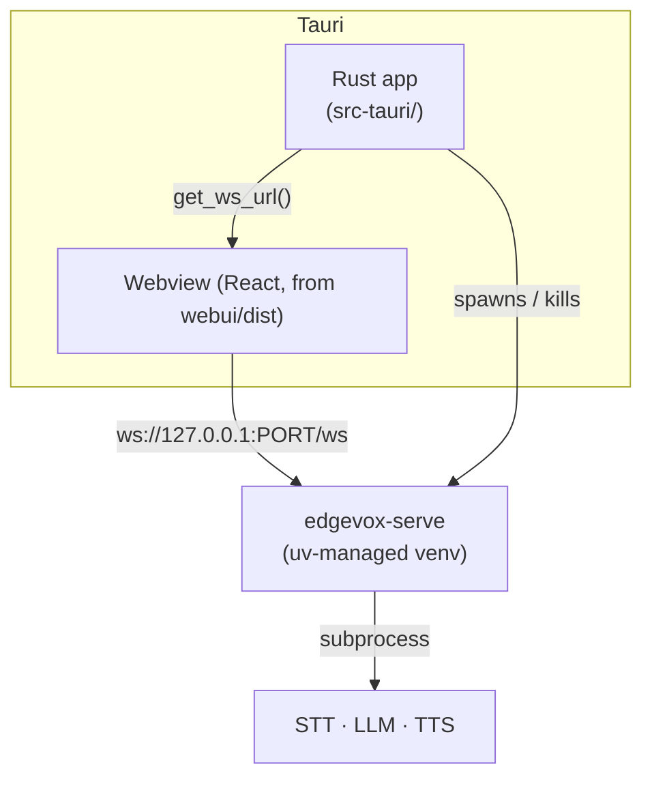

# Desktop App (Tauri)

Native desktop shell that wraps the EdgeVox web UI and launches
`edgevox-serve` as a managed Python sidecar. Offline-first, small installer,
no Electron.

## Architecture



The Rust shell manages the Python sidecar's lifecycle:

1. **First run**: `uv venv` under the platform data dir +
   `uv pip install edgevox` (or the dev source when
   `EDGEVOX_DESKTOP_DEV_SRC` points at a local checkout).
2. **Every run**: spawn `edgevox-serve --host 127.0.0.1 --port <free>`,
   forward stdout/stderr to the Rust logger.
3. **On exit**: SIGTERM the child + wait, then kill if still alive.

The frontend calls the Tauri command `get_ws_url()` once on startup and
connects to the returned `ws://127.0.0.1:PORT/ws`. Plain-browser builds
still work — `App.tsx` falls back to same-origin when no Tauri runtime is
present.

## Prereqs

- Rust ≥ 1.75 (https://rustup.rs/)
- Node.js ≥ 18
- [`uv`](https://docs.astral.sh/uv/getting-started/installation/) on `$PATH`
- OS-specific Tauri deps: https://tauri.app/start/prerequisites/ (on Linux
  this includes `libpango`, `libwebkit2gtk-4.1`, `libgtk-3`)

## Dev loop

```bash
cd webui
npm install
cargo install tauri-cli --version '^2.0'

# Point the sidecar at your working-copy edgevox
export EDGEVOX_DESKTOP_DEV_SRC=$(git rev-parse --show-toplevel)

# Launches Vite on :5173 + native window
cargo tauri dev
```

First launch provisions the venv (~1-2 min). Subsequent launches start in
about a second.

## Shipping an installer

```bash
npm run build           # React → webui/dist
cargo tauri build       # bundle desktop binary + installer
```

Output under `webui/src-tauri/target/release/bundle/`:

- Linux — `.deb`, `.AppImage`, `.rpm`
- macOS — `.app`, `.dmg`
- Windows — `.msi`, `.exe`

Installer size is ~10-20 MB. It does **not** include the venv (provisioned
on first run) or models (downloaded to the Hugging Face cache on first use,
~3-5 GB total for STT + LLM + TTS).

## Chess in the desktop app

Set the `--agent` flag in the sidecar invocation so the server loads the
chess agent on boot. The simplest way today is a tiny env override picked
up in `src-tauri/src/sidecar.rs` — or edit the spawn call to append your
flags:

```rust
cmd.args([
    "--host", "127.0.0.1",
    "--port", &port.to_string(),
    "--agent", "edgevox.examples.agents.chess_partner:build_server_agent",
]);
```

When this lands, the chess board + eval bar + move list mount automatically
in the React panel the first time `chess_state` arrives.

## Known gaps (prototype)

- **`uv` not bundled** — users install it themselves. Bundling as a Tauri
  resource is the next step. See `src-tauri/src/sidecar.rs::uv_binary`.
- **`get_ws_url` blocks** on first-run install. Should emit progress events
  via `app_handle.emit(...)` so the frontend shows a splash.
- **No app icons yet** — run `cargo tauri icon <logo.png>` from `webui/`
  with a 1024×1024 logo before `tauri build`.

## Why Tauri (and not Electron)

| Dimension        | Tauri                | Electron              |
|------------------|----------------------|-----------------------|
| Installer size   | ~10-20 MB            | ~150 MB               |
| Memory per app   | ~50 MB resident      | ~300 MB resident      |
| Native WebView   | system (WebView2 / WebKit) | bundled Chromium |
| Rust toolchain   | required for build   | not required          |

For EdgeVox's "offline, lightweight, runs on a Jetson" ethos, Tauri's
footprint wins by a wide margin. The Rust requirement only affects people
*building* the app — installer users don't see it.
